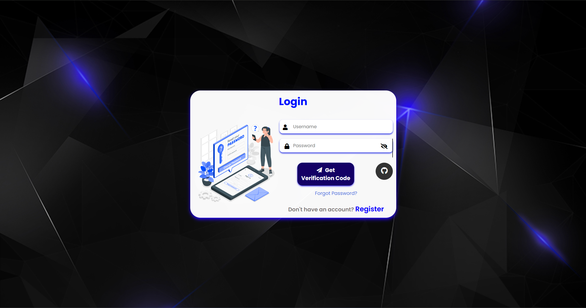
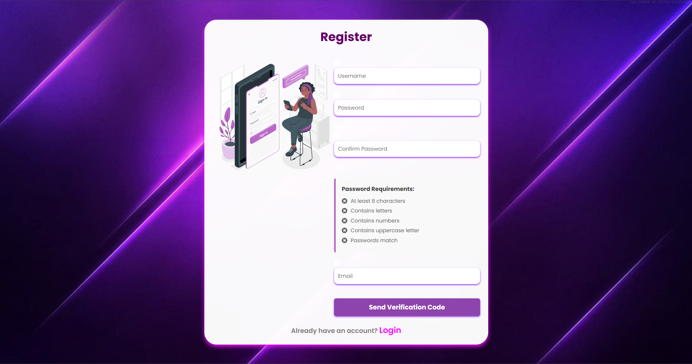
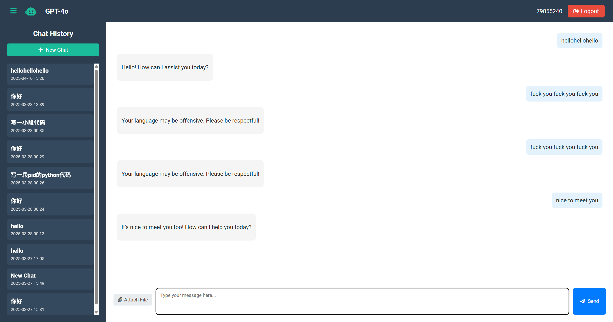
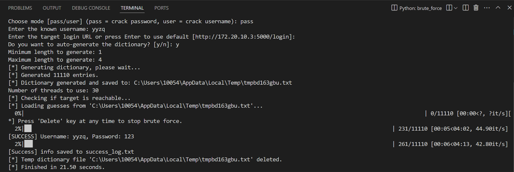
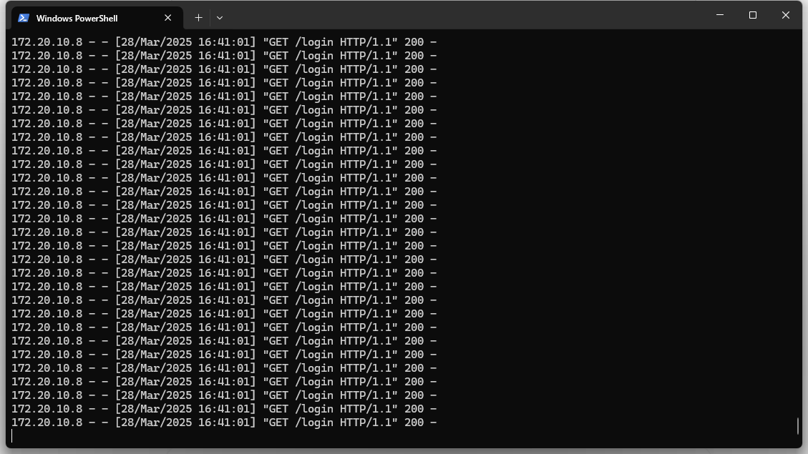

# ELEC0138 Assignment Group 5 
## Resilient Security: Threat Modeling and Defensive Strategies for Large Language Models Platforms


# Abstract
This project explores the security challenges and threat modeling of large language model (LLM) platforms. By analyzing potential vulnerabilities and implementing defensive strategies, we aim to enhance the resilience of AI-driven systems. The study includes the development of a Flask-based LLM platform, simulated attack tools for testing, and a comprehensive evaluation of security measures. Our findings provide insights into securing LLM platforms against real-world threats while maintaining usability and performance.

For a detailed walkthrough of the project, watch the following video:
[](https://www.youtube.com/watch?v=AD08LkxL74s)

# Table of Contents
1. [LLM platform Flask backend](#llm-platform-flask-backend)
      - [Features](#features)
      - [Setup](#setup)
      - [Usage Guide](#usage-guide)
2. [Simulated attack tools](#simultaed-attack-tools)
      - [Brute Force Dictionary Attack](#1-brute-force-dictionary-attack-brute_forcepy)
      - [Multi-threaded DDoS Simulator](#2-multi-threaded-ddos-simulator-multi_ddospy)


# LLM platform Flask backend
## Features

This is an AI chat platform built with Flask and the OpenAI API, offering the following features:

### Core Features

1. **User Authentication System**
      - Account registration and login
      - GitHub OAuth integration
      - Secure password encryption
      - User session management
      - **Multi-Factor Authentication (MFA)**: Adds an additional layer of security by requiring users to verify their identity through a secondary method, such as a one-time password (OTP) sent via email or an authenticator app.
      - **Transport Layer Security (TLS)**: Ensures all data transmitted between the client and server is encrypted, protecting sensitive information from interception.
      - **Rate Limiting**: Prevents abuse by limiting the number of requests a user can make within a specific time frame, mitigating brute force and DDoS attacks.

      
      

2. **Chat Functionality**
      - Support for multiple AI models (GPT-4, GPT-4o, GPT-4-Turbo, GPT-3.5-Turbo)
      - Real-time model switching
      - Message history and conversation management
      - New conversation creation

3. **File Processing**
      - Support for uploading TXT, PDF, DOC, DOCX files
      - Automatic content extraction for AI analysis
      - File storage in MongoDB database
      - Download functionality for uploaded files

4. **Interface Features**
      - Responsive design
      - Collapsible sidebar
      - Dark theme interface
      - File attachment display and management

5. **AI-based Mechanism to Prevent Sensitive Data Pollution**

      To enhance platform security, we implemented an AI-based mechanism to filter sensitive or toxic user inputs, preventing database pollution. A lightweight text classification model integrated into the Flask backend detects harmful content in real-time, issues warnings, and ensures only sanitized data is stored. This model is provided on https://huggingface.co/ZheZHEZHE020106/zt-harmful_language_detecting
      

      | Epoch | Training Loss | Accuracy | F1 Score |
      |-------|---------------|----------|----------|
      | 1     | 0.1827        | 0.9555   | 0.8207   |
      | 2     | 0.0721        | 0.9600   | 0.8174   |
      | 3     | 0.0217        | 0.9605   | 0.8192   |

      

                  
## Setup

### System Requirements

- Python 3.8+
- MongoDB server
- NodeJS (optional, for frontend development)

### Installation Steps

1. **Clone the Repository**
```bash
git clone https://github.com/yourusername/ELEC0138Coursework_Group5.git
cd ELEC0138Coursework_Group5
```
2. **Create and Activate Virtual Environment**
```bash
cd flask_backend/env
conda env create -f environment.yml
conda activate security
```
3. **Configure Environment Variables**

Create a `.env` file in the `flask_backend` directory with the following content:
```bash
# Environment Variables

- `OPENAI_API_KEY`: Your OpenAI API key for accessing GPT models.
- `MONGODB_URI`: The connection string for your MongoDB database.
- `GITHUB_CLIENT_ID`: The client ID for GitHub OAuth integration.
- `GITHUB_CLIENT_SECRET`: The client secret for GitHub OAuth integration.
- `FLASK_SECRET_KEY`: A secret key used for Flask session management and security.

# Email Settings

- `EMAIL_USERNAME`: The email address used for sending emails.
- `EMAIL_PASSWORD`: The app-specific password for the email account.
- `EMAIL_FROM`: The sender's email address for outgoing emails.
```
For more details on apply for github's OAuth ID&Secert key, you could refer [this guide](https://testdriven.io/blog/flask-social-auth/#user-management).

## Usage Guide
Starting the Application
1. **Launch the Server**
```bash
cd flask_backend
python app.py
```


# Simultaed attack tools

The initial version of the platform has many security vulnerabilities, against which we have designed some attack tools, including Brute Force Dictionary Attack and DDOS attack.

## 1. Brute Force Dictionary Attack (brute_force.py)

This tool performs a multithreaded brute-force dictionary attack on a login endpoint to test password or username strength.

## Core Features:
- Supports password or username cracking modes
- Allows manual or automatic dictionary generation
- Multi-threaded for speed
- Detects login success based on HTTP 302 redirection
- Interruptible with the Delete key

## Usage Guide
1. Launch the brute force attack
```bash
cd attack_simulation
python brute_force.py
```

2. Specify the following the on-screen prompts:

- Select cracking mode (pass or user)
- Enter the known credential (username or password)
- Provide target login URL (default: http://172.20.10.3:5000/login)
- Provide or auto-generate a dictionary
- Set the number of threads

Results (if successful) are saved to success_log.txt.

## Brute Force Attack Demo

Below is a demonstration of the brute force attack script in action:



## 2. Multi-threaded DDoS Simulator (multi_ddos.py)

This tool performs a configurable way to simulate Denial-of-Service attacks for stress testing purposes.

## Supported Attack Modes:
- http: HTTP GET flood
- udp: UDP packet flood
- syn: TCP SYN flood (requires root)
- ipfrag: IP fragmentation flood (requires root)

## Usage Guide
1. Launch the ddos attack
```bash
cd attack_simulation
python multi_ddos.py
```

2. Specify the following the on-screen prompts:

- Attack type
- Target IP/URL

## DDoS Attack Demo

Below is a demonstration of the DDoS attack script in action:

